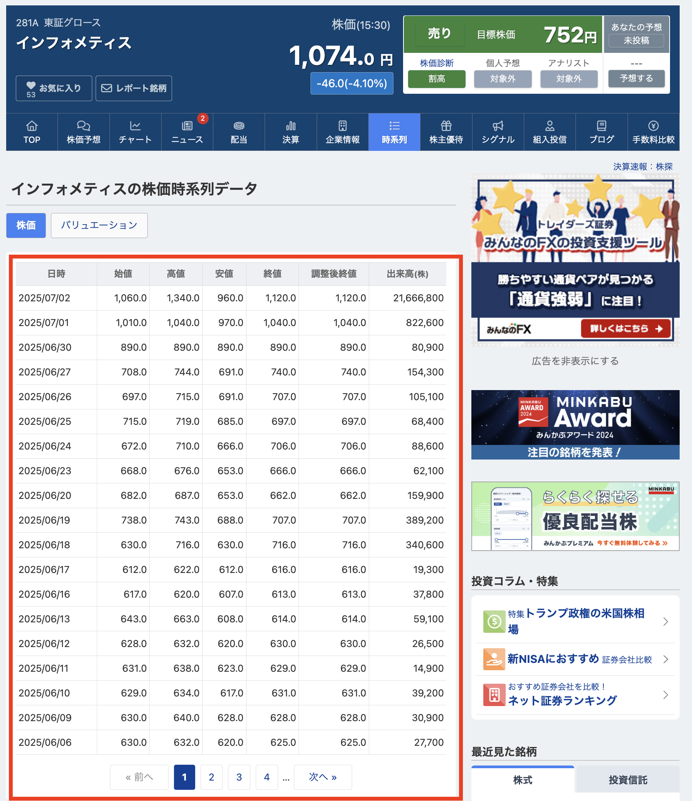

# 📈 Playwright Stock Scraper

[](https://codecov.io/gh/ph-piment/scraping-sandbox)
[](https://www.python.org/)
[](LICENSE)

An elegant, asynchronous scraper for historical stock data from [Minkabu](https://minkabu.jp/), built with [Playwright for Python](https://playwright.dev/python/).

---

## ✨ Features

- ✅ Async scraping via Playwright (headless)
- 📄 Targets `/daily_bar` timeline for a given stock symbol
- 🔍 Extracts: `Date`, `Open`, `High`, `Low`, `Close`, `Volume`
- 🔁 Handles pagination by clicking `次へ`
- 💾 Outputs `./outputs/playwright_stock_scraper/{symbol}.{csv|json}`
- 🛠 Includes basic error handling & retry logic

## 🗂 Scraping Target

This scraper extracts data from the following section of the [Minkabu stock detail page](https://minkabu.jp/stock/{symbol}/daily_bar):

📍 **HTML Table: 株価時系列データ (Historical Price Data)**

📷 Example: The stock price time series table scraped from Minkabu's `/daily_bar` page


The table includes:
- **Date**（日時）
- **Open**（始値）
- **High**（高値）
- **Low**（安値）
- **Close**（終値）
- **Volume**（出来高）

> Pagination is handled by clicking the 「次へ」 button to traverse all pages.

---

## 🚀 Usage

### 1. Install dependencies

```bash
pip install -r requirements.txt
playwright install
```

💡 playwright install is required to download the browser binaries.

### 2. Run the scraper
```bash
PYTHONPATH=. python playwright_stock_scraper/main.py <symbol> [csv|json]
```
- Replace <symbol> with a valid Minkabu stock symbol (e.g., 281A, 6501, 7203, etc).
- The second argument specifies the output format:
  - csv (default if omitted)
  - json

Examples
```bash
# Output as CSV (default)
PYTHONPATH=. python playwright_stock_scraper/main.py 281A

# Output as JSON
PYTHONPATH=. python playwright_stock_scraper/main.py 281A json
```

### 3. Output sample

- CSV output (./outputs/playwright_stock_scraper/281A.csv):

```bash
Date,Open,High,Low,Close,Volume
2025/07/01,1570,1590,1550,1560,1,234,000
2025/06/28,1540,1580,1530,1570,1,002,000
...
```

- JSON output (./outputs/playwright_stock_scraper/281A.json):

```bash
[
  {
    "Date": "2025/07/01",
    "Open": "1570",
    "High": "1590",
    "Low": "1550",
    "Close": "1560",
    "Volume": "1234000"
  },
  {
    "Date": "2025/06/28",
    "Open": "1540",
    "High": "1580",
    "Low": "1530",
    "Close": "1570",
    "Volume": "1002000"
  },
  ...
]
```

## 🧪 Testing & Quality

This repo includes built-in CI checks:

✅ pytest + coverage
🎨 black, isort, flake8, pylint, mypy
🔐 bandit, pip-audit for security
📦 Uses requirements.txt for consistent builds
To run tests locally:

```
PYTHONPATH=. pytest
```

## 📄 Notes

- ✅ Minkabu's /stock/{symbol} is allowed in robots.txt
- 🧘‍♂️ Includes sleep between pages to avoid overloading the server
- 🚫 Use responsibly — this is for educational/demo use only

## 📂 Project Structure

```bash
playwright_stock_scraper/
├── main.py                 # CLI entrypoint
├── scraper.py              # Scraper logic
├── writer.py               # Output logic
├── usecase.py              # Use case: scrape + save
├── tests/
│   ├── test_scraper.py     # Scraper unit tests
│   ├── test_writer.py      # Writer module tests
│   └── test_usecase.py     # Use case tests
├── requirements.txt
├── pyproject.toml
└── README.md
```
